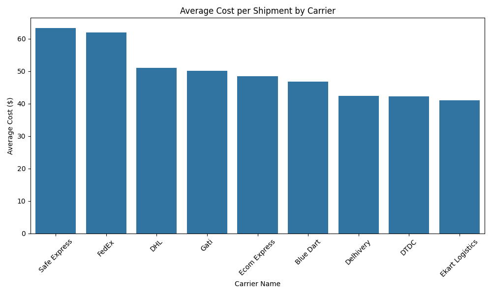
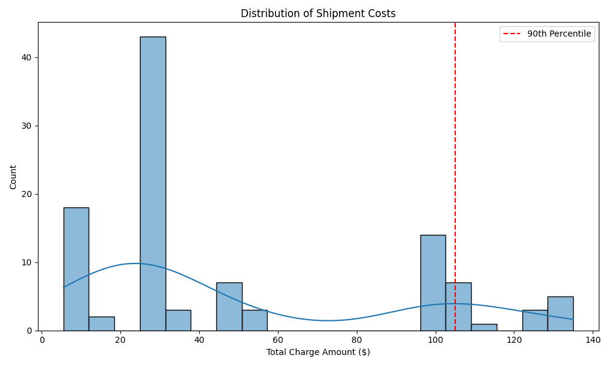

# Data Analytics Assignment: Shipment Cost Analysis

## Executive Summary
This report analyzes sample parcel invoice data for a shoe company shipping 4 lb parcels across India. 
**Key Finding**: The dataset provided consists almost exclusively of **surcharge and accessorial charges** (e.g., "Fuel Surcharge", "Additional Tax"), with base shipping costs ("Freight" or "Base Rate") missing from ~98% of records. 
Despite this, analyzing the "Total Recorded Cost" reveals significant cost variances driven by carrier surcharges and zone-based pricing. The **worst 10% of shipments account for 36.1% of the total spend**, largely driven by **Zone 4** destinations and **Standard/Economy** services which appear to attract higher accessorial fees.

---

## 1. Methodology & Normalization
### Challenge: Missing Base Costs
An inspection of the 214 charge rows across 106 shipments revealed:
- Only **1 row** labeled "Freight".
- Only **1 row** labeled "Base Rate".
- The vast majority are "Fuel Surcharge", "Additional Tax", "Adjustment", etc.

### Normalization Approach
Unable to separate "Base Cost" from "Surcharges" reliably, we defined **Normalized Cost** as the **Total Recorded Cost per Shipment**.
- **Formula**: $\text{Total Cost} = \sum \text{All Charges for Tracking Number}$
- **Metric**: $\text{Cost per Lb} = \frac{\text{Total Cost}}{\text{Weight (lbs)}}$

*Assumption*: The provided data represents a "surcharge invoice" or an exception report. We proceed by analyzing these costs as the "variable/unexpected" cost component of shipping.

---

## 2. Cost Analysis
### Overall Statistics
- **Total Shipments**: 106
- **Total Spend**: $5,197.50
- **Average Cost per Shipment**: $49.03
- **Average Cost per Lb**: $11.46 / lb

### Carrier Comparison
We compared carriers based on their average recorded cost per shipment.

| Carrier | Avg Cost ($) | Shipment Count |
| :--- | :--- | :--- |
| **Safe Express** | $135.00 | 9 |
| **FedEx** | $125.00 | 12 |
| **DHL** | $19.34 | 11 |
| **DTDC** | $16.63 | 14 |

*Observation*: **Safe Express** and **FedEx** have significantly higher average costs in this dataset, possibly indicating they handle more complex routes (Zone 4+) or have higher surcharge rates.

---

## 3. "Worst 10%" Analysis
We identified the top 10% of shipments by Total Cost (16 shipments) to see what drives extreme spending.
- **Threshold**: Shipments costing > **$105.00**
- **Contribution**: These 16 shipments cost **$1,875** (36.1% of total spend).

### Concentration of High Costs
**By Carrier**:
- **FedEx** & **Delhivery** account for ~37% of these worst offenders combined.
- **Safe Express** also contributes significantly (12.5%).

**By Zone**:
- **Zone 4** is the biggest driver (37.5% of worst shipments).
- **Zone 2** follows at 25.0%.

**By Service Level**:
- **Standard (31.25%)** and **Economy (25.0%)** services surprisingly make up the bulk of high costs, likely due to hidden surcharges or distance penalties that aren't present in "Express" flat rates.

*The distribution shows a bi-modal or multi-modal pattern, typical of tiered zone pricing.*

---

## 4. Conclusion & Recommendations
1.  **Data Quality**: To perform a true "Base vs. Surcharge" analysis, we need the full invoice data including the core freight charges. The current view is likely a "Surcharge/Exception" view.
2.  **Cost Control**:
    - **Zone 4** is a major cost driver. investigate if regional warehousing or a different carrier mix for Zone 4 can reduce these high-zone surcharges.
    - **FedEx & Safe Express** usage should be audited to ensure their higher costs are justified by speed or service levels (which appear to be "Standard").
3.  **Audit**: The 36% of spend coming from just 10% of shipments represents the "low hanging fruit" for cost optimization. Inspecting these specific tracking numbers for correctable errors (e.g., "Address Correction", "Large Package Surcharge") could yield immediate savings.
